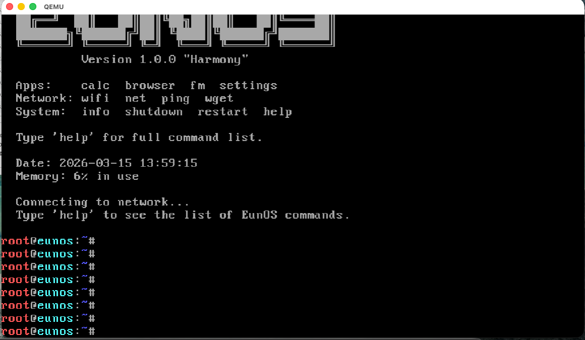
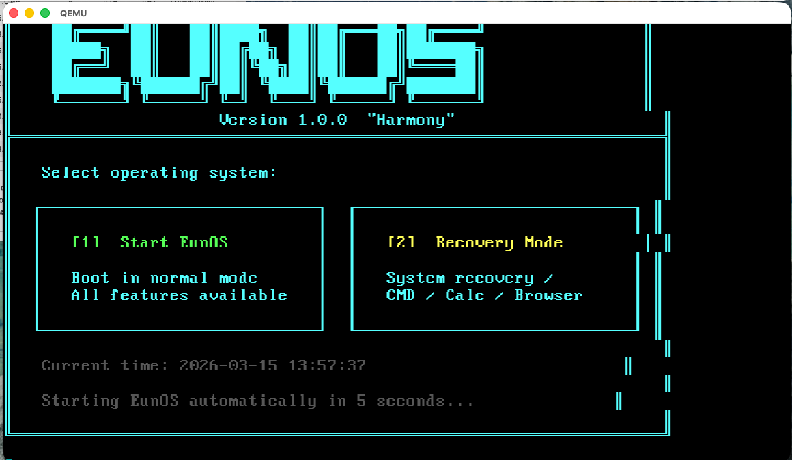
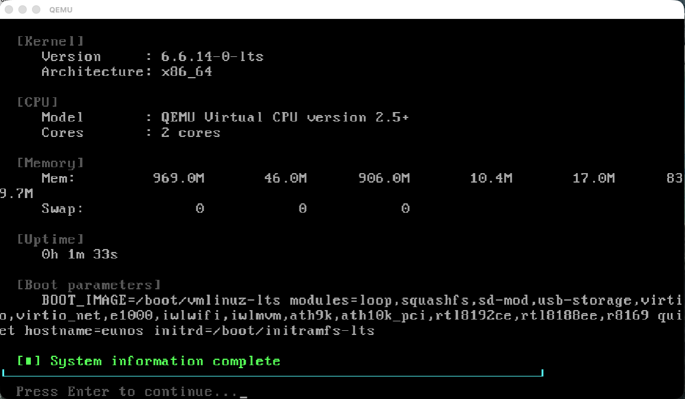

# EunOS — Built entirely by Claude Code

> A custom Linux-based operating system, entirely built by **Claude Code** (Anthropic's AI coding assistant).

## Download

Download the EunOS ISO file from the official download page.

**[https://eunos-download.surge.sh](https://eunos-download.surge.sh)**


## What is EunOS?

EunOS is a lightweight custom OS built on top of **Alpine Linux**, designed to run as a live system from USB or CD/DVD.

It takes Alpine Linux as a base — keeping all its core functionality (package management, filesystem, networking) — and adds a fully custom layer on top:

- A custom boot selector screen (Normal Mode / Recovery Mode)
- A custom terminal UI with ASCII logo on boot
- Built-in apps: calculator, text browser, file manager, settings menu
- Network tools: WiFi manager, Ethernet connection
- A full Recovery Environment with filesystem check, network diagnostics, and system reset
- Custom utilities: datetime, file editor, system info

Everything on top of Alpine — shell scripts, commands, bootloader config, and build system — was written by **Claude Code**.

---

## Features

- **Custom terminal UI** — Clean MOTD with ASCII art on boot
- **Built-in apps:**
  - `calc` — Calculator
  - `browser` — Text-based web browser (lynx)
  - `datetime` — Date & time display
  - `newfile` — Create and edit text files
  - `settings` — System settings menu
- **Network support:**
  - `net` — Connect via Ethernet (DHCP)
  - `wifi` — WiFi manager using wpa_supplicant
- **System commands:**
  - `shutdown` — Power off
  - `restart` — Reboot
- **File Manager** — `fm` or `eunfm`
- **Recovery Mode** — Troubleshoot, tools, system info
- **Boot Selector** — Choose EunOS or Recovery at startup

---

## Screenshots

| Boot Selector | Main Terminal |
|---|---|
|  |  |

| Recovery Menu | System Info |
|---|---|
|  |  |

---

## Commands Reference

```
help          - Show all available commands
calc          - Calculator
browser       - Text web browser
datetime      - Show date and time
fm            - File manager
newfile       - Create a new text file
net           - Connect to internet (Ethernet)
wifi          - WiFi manager
settings      - System settings
shutdown      - Power off
restart       - Reboot
```

---

## How to Run

### Requirements
- x86_64 PC or laptop
- 512MB+ RAM
- USB drive (1GB+) or CD/DVD

### Boot from USB
```bash
# On macOS/Linux — write ISO to USB
sudo dd if=EunOS-1.0.0-x86_64.iso of=/dev/sdX bs=4M status=progress

# Use MBR partitioning for older hardware (recommended)
```

### Run in QEMU (virtual machine)
```bash
qemu-system-x86_64 \
  -cdrom EunOS-1.0.0-x86_64.iso \
  -m 512 \
  -boot d \
  -vga std
```

---

## Build from Source

### Requirements
- macOS or Linux
- `xorriso` installed

### Build
```bash
cd scripts
./build.sh
```

Output: `EunOS-1.0.0-x86_64.iso`

---

## Project Structure

```
EunOS/
├── eunos_overlay/          # OS customization files
│   ├── etc/
│   │   ├── motd            # Boot message
│   │   ├── inittab         # Init configuration
│   │   └── profile.d/      # Shell environment
│   ├── usr/local/bin/      # EunOS commands & apps
│   │   ├── eunos-tty1-init # Terminal UI init
│   │   ├── eunos-recovery  # Recovery mode
│   │   ├── eunos-calc      # Calculator
│   │   ├── eunos-browser   # Browser launcher
│   │   ├── eunos-wifi      # WiFi manager
│   │   ├── eunos-net       # Network manager
│   │   └── ...
│   └── root/
│       ├── tutorial.txt    # Beginner's guide
│       └── .profile        # Root shell profile
├── bootloader/             # GRUB & ISOLINUX config
├── build/                  # Build workspace
├── scripts/
│   └── build.sh            # ISO build script
└── tutorial.txt            # User tutorial
```

---

## Tech Stack

| Component | Technology |
|---|---|
| Base OS | Alpine Linux 3.19 (x86_64) |
| Boot (BIOS) | ISOLINUX / Syslinux |
| Boot (UEFI) | GRUB 2 |
| Shell | ash (busybox) |
| Network | wpa_supplicant, udhcpc |
| ISO Builder | xorriso |
| Built by | Claude Code (Anthropic) |

---

## Controls

- **ESC** — Exit menus
- **Arrow keys** — Navigate recovery menu
- **Enter** — Select
- **Ctrl+C** — Cancel current operation

---

## License

MIT License — Free to use, modify, and distribute.

---

*Made entirely by [Claude Code](https://claude.ai/code) — Anthropic's AI coding assistant*
*Version 1.0.0 | March 2025*

심지어 이것도 클로드 코드가 써줬습니다 ㅋㅋ
